# 一：Oracle的基本概念与安装

## 1：简介

ORACLE数据库系统是美国ORACLE公司（甲骨文）提供的以分布式数据库为核心的一组软件产品，是目前最流行B/S体系结构的数据库之一。ORACLE数据库是目前世界上使用最为广泛的数据库管理系统，作为一个通用的数据库系统，它具有完整的数据管理功能；作为一个关系数据库，它是一个完备关系的产品；作为分布式数据库它实现了分布式处理功能。但它的所有知识，只要在一种机型上学习了ORACLE知识，便能在各种类型的机器上使用它。

## 2：服务端安装

>   1．解压。oracle数据库安装包，如果是win7或者win8系统右键点击setupexe选择兼容性，以XP方式，并且以管理员方式运行，以及其他所有用户都按着此规则如图

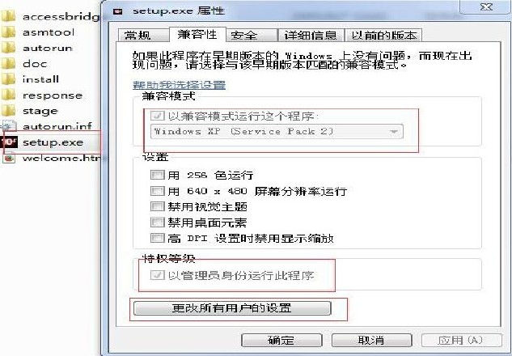

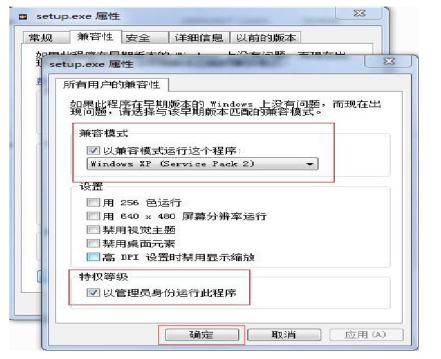

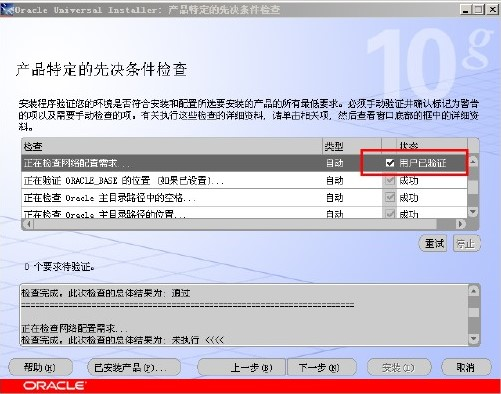

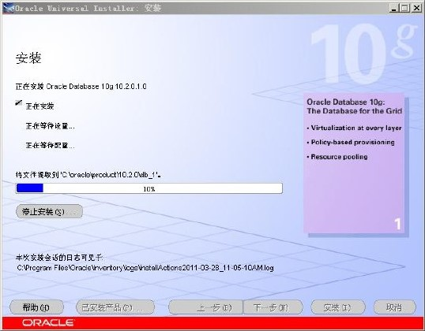

## 3：自带客户端工具的安装

## 4：PLSQL工具的安装

（1）设置tools->preferences->connection中sqlplus路径


​      （2）确认服务器上的tnsnames.ora和linstener中的host为虚拟机ip地址


 

  　（3）将服务器中tnsnames.ora文件拷贝到本地路径无需修改，如果是拷贝发的资料需要修改文件中远程orcl服务器的ip地址


 　（4）系统变量中设置TNS_ADMIN变量为tnsnames.ora文件目录


 

 8.解决中文乱码问题

查询select userenv('language') from dual;--AMERICAN_AMERICA.ZHS16GBK

查询select * from V$NLS_PARAMETERS;

在系统变量中设置NLS_LANG=AMERICAN_AMERICA.ZHS16GBK

重新启动PLSQL

## 5：基本使用

解锁scott用户设置密码为tiger

OracleDBConsoleorcl --可以不启动,用于管理Oracle的企业管理器的服务.

OracleJobSchedulerORCL --通常不启动,用于定期操作任务的服务

OracleOraDb10g_home1iSQL*Plus --可以不启动,isqlplus服务,用网页执行sql,11g已经取消这个功能

OracleOraDb10g_home1TNSListener --必须启动,这是临听,用于远程客户端连接你的Oracle

OracleServiceORCL --必须启动,这是Oracle数据库的服务


# 二：Oracle体系结构

## 1：基本概念


实例


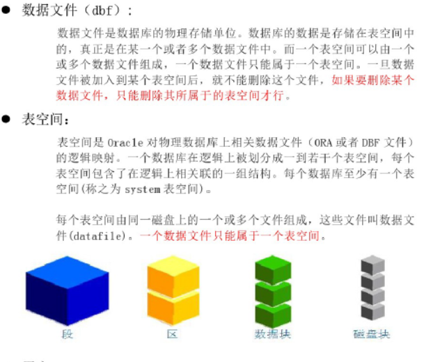

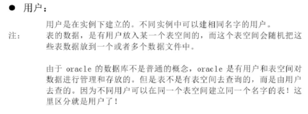

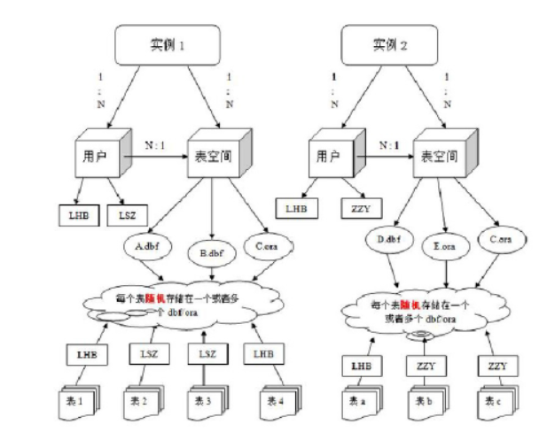

## 2：使用DDL语句管理表

\--创建表空间

```sql
create tablespace xqc
--删除表空间
drop tablespace xqc
--创建用户
create user xqc
identified by xqc
default tablespace xqc
--给用户授权
--oracle中常见角色
connect --连接角色，基本角色
Resource--开发者角色
Dba——超级管理员角色
--给xqc授予dba角色
grant dba to xqc
--切换到xqc用户下
--修改列类型
alter table person modify gender char(1)
--char为固定长度
--修改列名称
alter table person drop colum sex;
序列的使用
--默认重1开始，依次递增，主要给主键赋值使用
create sequence s_person
dual:虚表，只为了补全语法，没有任何意义
select s_person..currval from dual;
Scott用户，密码为tiger
--解锁scott用户
alter user scott account unlock;
--解锁scoott用户的密码(也可以用来重置密码)
alter user scott identified by tiger
--切换到scoott用户，默认有四张表

```


# 三：基本语法

sql的基本语法参考mysql的，这里着重写oracle与mysql不同的地方


## 1：Select

## 2：过滤与排序

## 1：多表查询

### 1：外连接

## 2：子查询

## 3：集合运算

# 四：函数

## 1：通用函数（Oracle独有）

1.1：NVL

NVL(列|默认的代替值)

如果oracle的列为空那么显示第二个参数的值，如果列的值不为空，则显示列本来的值。

```sql
--算出工资+奖金的总和，但是奖金有空值，如果null和任意数字做算术运算，结果都是null
lect e.sal * 12 +e.comm from emp e;
select e.sal * 12 + nvl(e.comm,0) from emp e;
```

1.2：DECODE多数值判断

DECODE(列,匹配内容1，显示内容1，匹配内容2，显示内容2,未匹配内容的默认值);

根据不同的结果在输出的时候进行一个数据的转换


call函数


## 2：单行函数

单行函数：作用于一行，返回一个值

多行函数：作用于多行，返回一个值

是放在SQL中还是放在Java中处理？？

2.1：trunc直接截取小数

TRUNC(列|数字 [,保留小数位])

2.2：字符函数

```sql
--转大写
select upper('yes') from dual;--YES
--转小写
select lower('YES') from dual;--yes
length（），
replace（），
substr()


```


2.3：数值函数

```sql
--四舍五入，后边参数表示保留的位数
select round(26.16,1) from dual;
trunc（），
mod（）
```

2.4：日期函数（不同于mysql）

```sql
--查询emp表中所有员工入职距离现在几天
select sysdate - e.hiredate from emp e;
--算出明天此刻
select sysdate+1 from dual;
add_months(),

--查询距离现在几月
select months_between(sysdate,e.hiredate) from emp e;
--查询距离现在几年
select moths_between(sysdate,e.hiredate)/12 from emp e;
--查询距离现在几周
select round((sysdate-e.hiredate)/7) from emp e;
--转换函数
select to_char(sysdate,'fm yyyy-mm-dd hh24:mi:ss') from dual;
--字符串转日期
select to_date('2018-6-7 16:39:50','fm yyyy-mm-dd hh24:mi:ss') from dual;


```


转换函数

通用函数

nvl(),

nvl2()


## 2：多行函数

2.1：分页

```sql
--表工资倒序排序后，每页五条记录，查询第二页
select * from (
    select rownum rn ,e.* from(
        select * from emp order by sal desc
    )e where rownum<11
)where rn >5
```

Mybatis的PageHelper插件也是这个原理,在最外层过滤后添加语句

```sql
select * from(
	……
)where rownum <=20
```


2.2：视图


索引


# 五：事务

Oracle默认不自动提交，用户需手动提交，写commit或点击commit按钮，而mysql默认自动提交。


# 五：PLSQL的使用

程序结构，变量，流程控制，游标

指在SQL命令语言中增加了过程处理语句（如分支，循环等）

PLSQL新建TestWindow

PLSQL不区分大小写

## 5.1：程序结构

```plsql
declare
	--声明本地变量，游标
begin
	--执行语句
	--异常处理
end;
```

1：输出helloWorld

```plsql
declare
	--声明本地变量，游标
begin
	--java:System.out.println("Hello World");
	DBMS_OUTPUT.PUT_LINE('hello world');
end;
```

cmd输入sqlplus以scott登录密码为tiger

默认输出关闭，设置打开，以/结束


## 5.2：变量

变量名  变量类型（变量长度） 例如：v_name varchar2(20)

1）普通变量

直接赋值语句：=

语句赋值，使用select ……into……赋值

例：

```plsql
--打印人员信息
DECLARE
	--姓名
	V_NAME VARCHAR2(20) :='zhangsan';
	--薪水
	V_SAL NUMBER;
	--地址
	V_ADDR VARCHAR2(200);
BEGIN
	--直接赋值
	V_SAL:=1580;
	--语句赋值
	SELECT '上海' INTO V_ADDR FROM DUAL;
	--打印输出
	DBMS_OUTPUT.PUT_LINE('姓名：'||V_NAME||',薪水'||V_SAL||',地址：'||V_ADDR);
END;
```

2）引用型变量

```plsql
--查询emp表中员工信息
DECLARE
	--姓名，不再直接使用类型，而是根据emp表中字段的变化而变化
	V_NAME EMP.ENAME%TYPE :='zhangsan';
	--薪水,同理
	V_SAL EMP.SAL%TYPE;
BEGIN
	--查询表中的姓名和薪水并赋值给变量
	SELECT ENAME SAL INTO V_NAME,V_SAL FROM EMP WHERE EMPNO = 7839;
	--打印输出
	DBMS_OUTPUT.PUT_LINE('姓名：'||V_NAME||',薪水'||V_SAL);
END;
```

3）记录型变量

接收表中一整行记录，相当于Java中的一个对象

语法：变量名称 表名%ROWTYPE 例如V_EMP EMP%ROWTYPE

```PLSQL
--查询emp表中员工信息
DECLARE
	--记录型变量
	v_emp emp%ROWTYPE;
BEGIN
	--查询表中的姓名和薪水并赋值给变量
	SELECT * INTO EMP FROM EMP WHERE EMPNO = 7839;
	--打印输出
	DBMS_OUTPUT.PUT_LINE('姓名：'||EMP.ENAME||',薪水'||EMP.SAL);
END;
```

## 5.3：流程控制

1）条件分支

语法：


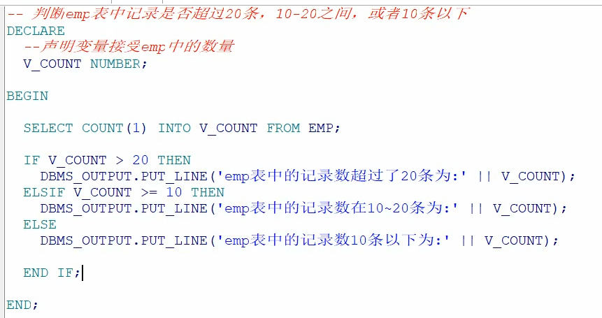

2）循环

语法：


例：

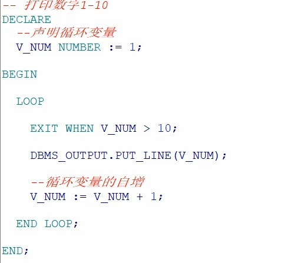

## 5.4：游标

用于存储一个查询返回的多行数据（结果集，类似于Java的jdbc连接返回的ResultSet集合）通过遍历游标，可以逐行访问处理该结果集的数据

使用

声明——>打开——>读取——>关闭

1）语法


2）游标的属性


3）例

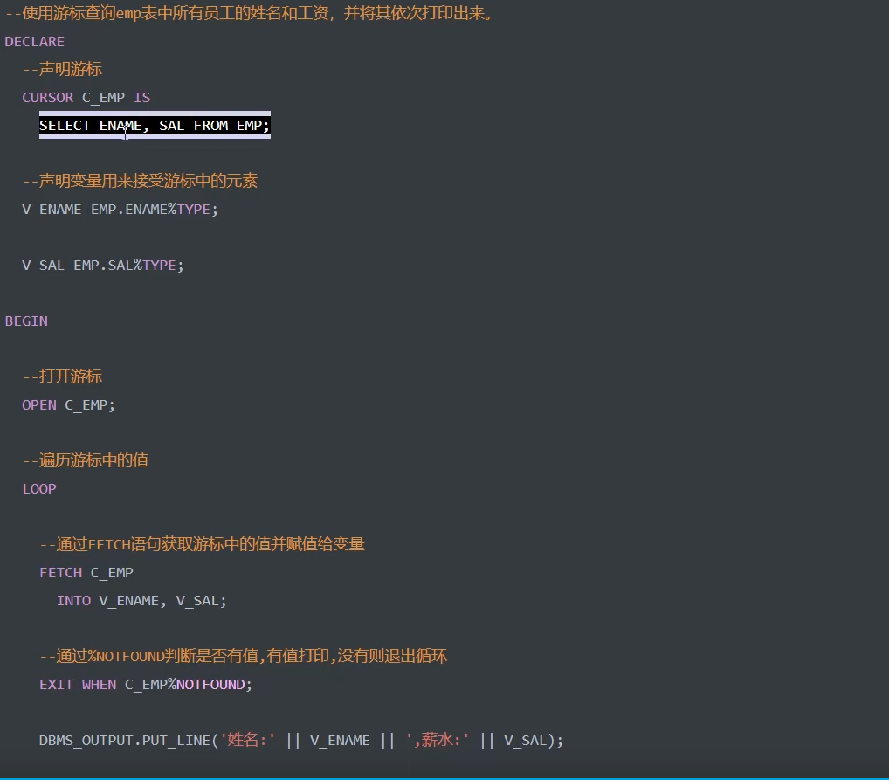


4）带参数的游标


```plsql
--声明时修改
CURSOR c_emp(v_deptno emp.deptno%TYPE) IS ENAME,SAL FROM EMP WHERE deptno = v_deptno;
--打开时修改,传入参数
OPEN c_emp(10);
```


# 七：存储过程procedure

为了特定的业务功能，会向数据库进行多次连接关闭（连接关闭最耗费资源）需要对数据库进行多次IO读写，性能很低，

官方建议：能放在数据库中的就不要放到程序中，可能出错，而且数据库可以日志恢复

但是（维护可就难了）

语法


## 7.1：不带参数的

1：创建存储过程

```plsql
CREATE OR REPLACE PROCEDURE p_hello IS
BEGIN
	DBMS_OUTPUT.PUT_LINE('hello world');
END P_HELLO;
```

2：使用

```SQL
BEGIN 
	--直接输入调用存储过程的名称
	p_hello;
END P_HELLO;
```

在sqlplus中


注意：

is和as是可以互用的

过程中没有declare关键字，declare用在语句块中

## 7.2：带参数的存储过程

有输入参数和输出参数之分


使用


## 7.3：带输出参数的


## 7.4：Java执行存储过程

Connection对象

1）传统方式

```java
//1,加载驱动
Class.forName("oracle.jdbc.driver.OracleDriver");
//2，获取连接对象
String url = "jdbc:oracle:thin:@localhost:1521:xe";
String user = "scott";
String password = "tiger";

Connection conn = DriverManager.getConnection(url,user,password);
//3：获取语句对象
String sql = "{call p_querysal_out(?,?)}";
CallableStatement call = conn.prepareCall(sql);

//4:设置输出参数
call.setInt(1,7839);
//5:注册输出参数
call.registerOutParameter(2,OracleTypes.DOUBLE);
//6:执行存储过程
call.execute();
//7:获取输出参数
double sal =call.getDouble(2);

System.out.println(sal);
//8.释放资源
call.close();
conn.close();
```


# 七：触发器


# 六：常用SQL语句


与mysql的区别

1：

mysql以表级锁为主，对资源锁定的粒度很大，虽然InnoDB引擎的表可以用行级锁，但这个行级锁的机制依赖于表的索引，如果表没有索引，或者sql语句没有使用索引，那么仍然使用表级锁。

oracle使用行级锁，对资源锁定的粒度要小很多，只是锁定sql需要的资源，并且加锁是在数据库中的数据行上，不依赖与索引。所以oracle对并发性的支持要好很多。


# 八：优化

执行过程：


## 执行计划

执行计划是一条查询语句在Oracle中执行过程或者访问路径的描述.

查看执行计划：PLSQL中按F5


基数：返回的结果集行数

字节：执行该步骤后返回的字节数

耗费(cust),CPU耗费：Oracle估计的该步骤的执行成本，用于说明SQL执行的代价，理论上越小越好.

执行顺序：根据缩进来判断，缩进最多的最先执行(缩进相同时，最上面的最先执行)


## 表的访问方式

- TABLE ACCESS FULL(全表扫描)

Oracle会读取表中的所有行，并检查是否满足where语句中条件；

使用建议：数据量太大的表不建议全表扫描

- TABLE ACCESS BY ROWID(通过rowid的表存取)

ROWID的解释：oracle会自动加在表的每一行的最后一列伪列，表中并不会物理存储ROWID的值，一旦一行数据插入后，则其对应的ROWID在该行的生命周期内是唯一的，即使发生行迁移，该行的ROWID值也不变。

- TABLE ACCESS BY INDEX SCAN(索引扫描)

在索引块中即存储每个索引的键值，也存储具有该键值所对的ROWID.

索引的扫描分两步：首先是找到索引所对的ROWID，其次通过ROWID读取改行数据

索引扫描又分五种：

INDEX UNIQUE SCAN（索引唯一扫描）

INDEX RANGE SCAN（索引范围扫描）

INDEX FULL SCAN（索引全扫描）

INDEX FAST FULL SCAN（索引快速扫描）

INDEX SKIP SCAN（索引跳跃扫描）

## SQL语句处理过程


1.在共享池中查找SQL语句

2.检查语法

3.检查语义和相关的权限

4.合并(MERGE)视图定义和子查询

5.确定执行计划

## 优化

优化法则——漏斗法则

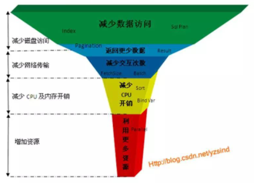

优化规则：

选择记录少的作为基表

用where替换Having

用in代替or


