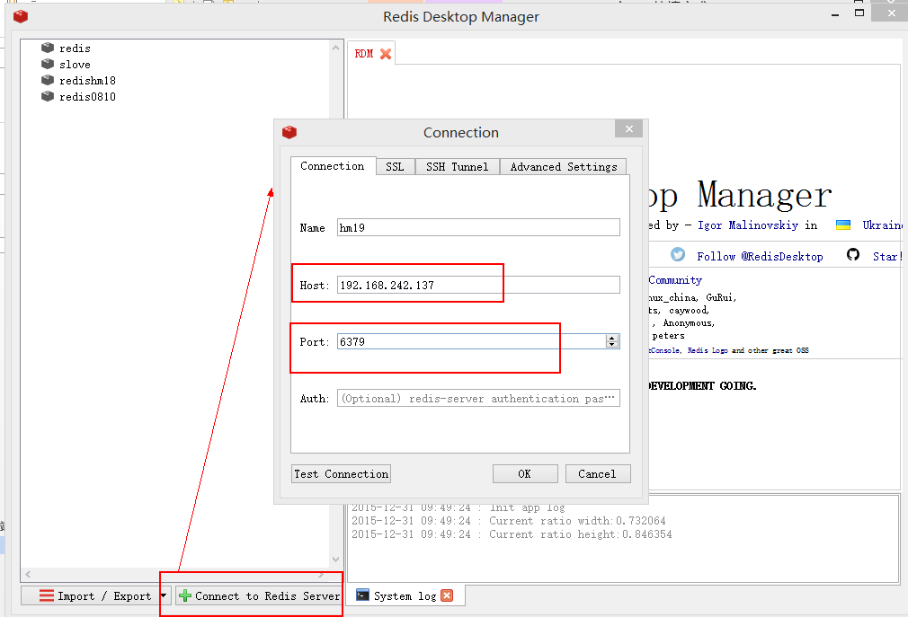
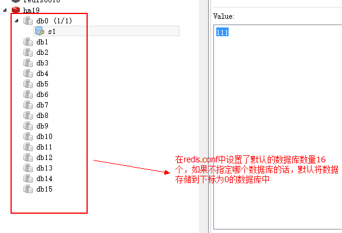

# 第二章：redis 安装

## 1：Window 安装

安装包地址：[https://github.com/microsoftarchive/redis](https://links.jianshu.com/go?to=https%3A%2F%2Fgithub.com%2Fmicrosoftarchive%2Fredis)

（1）进入安装包地址，选择 releases

（2）在 releases 页面下载最新版

msi 是可执行文件，按安装步骤安装即可。zip 直接解压就可以了。

端口号可保持默认的 6379，并选择防火墙例外，从而保证外部可以正常访问 Redis 服务。

以服务方式启动

以非服务方式启动

进入 CMD，进入 redis 的目录，执行如下命令

redis-server redis.windows.conf

设置密码

在 redis 目录中找到 redis.windows-service.conf 和 redis.windows.conf 两个文件

都打开找到 requirepass，加一行：requirepass 123456，123456 是密码，保存重新运行 redis，访问 redis 就需要密码了。

CMD 并进入 redis 目录，执行如下命令，执行前请保证 redis 服务已启动

redis-cli -h localhost -p 6379 -a 123456

## 2：Linux 安装

## 2.1：redis 下载

官网地址：<http://redis.io/>

下载地址：<http://download.redis.io/releases/redis-3.0.0.tar.gz>

## 2.2：redis 的安装

redis 的安装环境会安装到 linux 系统中。

第一步：安装 VMware，并且在 VMware 中安装 centos 系统（参考 linux 教程）。

第二步：将 redis 的压缩包，上传到 linux 系统

第三步：对 redis 的压缩包进行解压缩

```shell
tar -zxf redis-3.0.0.tar.gz
```

第四步：安装 c 语言环境（安装 centos 之后，自带 c 语言环境）

```shell
yum install gcc-c++
```

第五步：编译 redis 源码

```shell
cd redis-3.0.0
make
```

第六步：安装 redis

```shell
make isntall  PREFIX=/usr/local/redis
```

第七步：查看是否安装成功

## 2.3：redis 启动

### 前端启动

前端启动的命令：

```shell
./redis-server
```

前端启动的关闭：

强制关闭：Ctrl+c

正常关闭：

```shell
./redis-cli shutdown
```

启动界面：

前端启动的问题：

一旦客户端关闭，则 redis 服务也停掉。

### 后端启动

第一步：需要将 redis 解压之后的源码包中的 redis.conf 文件拷贝到 bin 目录下

```shell
cp /root/redis-3.0.0/redis.conf ./
```

第二步：修改 redis.conf 文件，将 daemonize 改为 yes

先要使用 vim redis.conf


第三步：使用命令后端启动 redis

```shell
./redis-server redis.conf
```

第四步：查看是否启动成功


关闭后端启动的方式：

强制关闭：

```shell
 kill -9 5071
```

正常关闭：

```shell
./redis-cli shutdown
```

在项目中，建议使用正常关闭。

因为 redis 作为缓存来使用的话，将数据存储到内存中，如果使用正常关闭，则会将内存数据持久化到本地之后，再关闭。

如果是强制关闭，则不会进行持久化操作，可能会造成部分数据的丢失。

# 第三章：Redis 客户端

## 3.1：Redis 自带的客户端

- 启动

启动客户端命令

```shell
./redis-cli -h 127.0.0.1 -p 6379
```

\-h：指定访问的 redis 服务器的 ip 地址

\-p：指定访问的 redis 服务器的 port 端口

还可以写成：

```shell
./redis-cli
```

使用默认配置：默认的 ip【127.0.0.1】，默认的 port【6379】

- 关闭
  
  Ctrl + c 或则输入 Quit

## 3.2：图形界面客户端

安装文件位置：

安装之后，打开如下：

)

防火墙设置：

)

Redis.conf 中的数据库数量的设置：

选择数据库的方式：

使用 select 加上数据库的下标 就可以选择指定的数据库来使用，下标从 0 开始

```sql
select 15
OK
```

## 3.3：Jedis 客户端

### jedis 介绍

Redis 不仅是使用命令来操作，现在基本上主流的语言都有客户端支持，比如 java、C、C\[[、C]]++、php、Node.js、Go 等。

在官方网站里列一些 Java 的客户端，有**Jedis**、Redisson、Jredis、JDBC-Redis、等其中官方推荐使用 Jedis 和 Redisson。在企业中用的最多的就是 Jedis，下面我们就重点学习下 Jedis。

Jedis 同样也是托管在 github 上，地址：https://github.com/xetorthio/jedis

### 工程搭建

添加 jar 包

### 单实例连接 redis

```java
@Test
public void jedisclient (){
    // Jedis
    Jedis jedis = new Jedis ( "192.168.242.137"，6379);//通过redis赋值
    jedis.set ("s2", "222");//通过redis取值
    string result = jedis.get ( "s2");
    system. out.println (result);
    //关闭jedis
    jedis.close ();
}
```

### 使用 jedis 连接池连接 redis 服务器

```java
@Test
public void jedisPool() {
    // JedisPool
    JedisPool pool = new JedisPool ("192.168.242.137",6379);/通过连接池获取jedis对象
    Jedis jedis = pool.getResource () ;
    jedis.set ( "s4","444");
    string result = jedis.get ("s3");
    system.out.println (result);
    //关闭jedis客户端
    jedis.close ( );
    //关闭连接池
    pool.close () ;
}
```

### Spring 整合 jedisPool（自学）

- 添加 spring 的 jar 包
- 配置 spring 配置文件 applicationContext.xml

```xml
<?xml version="1.0" encoding="UTF-8"?>
<beans xmlns="http://www.springframework.org/schema/beans"
    xmlns:xsi="http://www.w3.org/2001/XMLSchema-instance" xmlns:mvc="http://www.springframework.org/schema/mvc"
    xmlns:context="http://www.springframework.org/schema/context"
    xmlns:aop="http://www.springframework.org/schema/aop" xmlns:tx="http://www.springframework.org/schema/tx"
    xsi:schemaLocation="http://www.springframework.org/schema/beans
        http://www.springframework.org/schema/beans/spring-beans-3.2.xsd
        http://www.springframework.org/schema/mvc
        http://www.springframework.org/schema/mvc/spring-mvc-3.2.xsd
        http://www.springframework.org/schema/context
        http://www.springframework.org/schema/context/spring-context-3.2.xsd
        http://www.springframework.org/schema/aop
        http://www.springframework.org/schema/aop/spring-aop-3.2.xsd
        http://www.springframework.org/schema/tx
        http://www.springframework.org/schema/tx/spring-tx-3.2.xsd ">

    <!-- 连接池配置 -->
    <bean id="jedisPoolConfig" class="redis.clients.jedis.JedisPoolConfig">
        <!-- 最大连接数 -->
        <property name="maxTotal" value="30" />
        <!-- 最大空闲连接数 -->
        <property name="maxIdle" value="10" />
        <!-- 每次释放连接的最大数目 -->
        <property name="numTestsPerEvictionRun" value="1024" />
        <!-- 释放连接的扫描间隔（毫秒） -->
        <property name="timeBetweenEvictionRunsMillis" value="30000" />
        <!-- 连接最小空闲时间 -->
        <property name="minEvictableIdleTimeMillis" value="1800000" />
        <!-- 连接空闲多久后释放, 当空闲时间>该值 且 空闲连接>最大空闲连接数 时直接释放 -->
        <property name="softMinEvictableIdleTimeMillis" value="10000" />
        <!-- 获取连接时的最大等待毫秒数,小于零:阻塞不确定的时间,默认-1 -->
        <property name="maxWaitMillis" value="1500" />
        <!-- 在获取连接的时候检查有效性, 默认false -->
        <property name="testOnBorrow" value="false" />
        <!-- 在空闲时检查有效性, 默认false -->
        <property name="testWhileIdle" value="true" />
        <!-- 连接耗尽时是否阻塞, false报异常,ture阻塞直到超时, 默认true -->
        <property name="blockWhenExhausted" value="false" />
    </bean>

    <!-- redis单机 通过连接池 -->
    <bean id="jedisPool" class="redis.clients.jedis.JedisPool"
        destroy-method="close">
        <constructor-arg name="poolConfig" ref="jedisPoolConfig" />
        <constructor-arg name="host" value="192.168.242.130" />
        <constructor-arg name="port" value="6379" />
    </bean>
</beans>
```

- 测试代码

```java
    @Test
    public void testJedisPool() {
        JedisPool pool = (JedisPool) applicationContext.getBean("jedisPool");
        Jedis jedis = null;
        try {
            jedis = pool.getResource();
            jedis.set("name", "lisi");
            String name = jedis.get("name");
            System.out.println(name);
        } catch (Exception ex) {
            ex.printStackTrace();
        } finally {
            if (jedis != null) {
                // 关闭连接
                jedis.close();
            }
        }
    }
```
